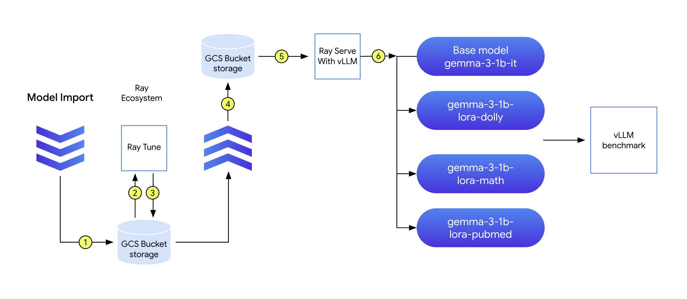
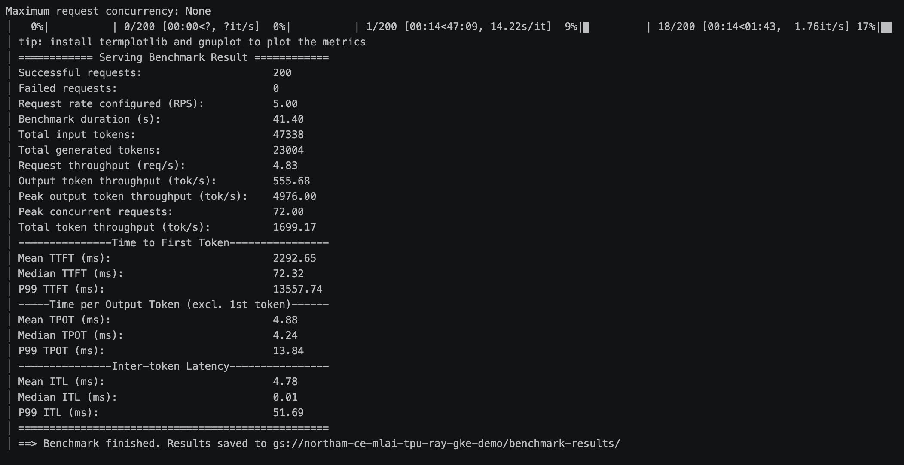

# Ray on GKE: Fine-tune & Serve Gemma 3 1B — End-to-End Demo

A production-style reference demo showing how to **fine-tune** and **serve** Google's Gemma 3 1B model on **GKE** using the **Ray Operator add-on**, with **GCSFuse** for checkpoint storage and **vLLM benchmarking** for performance validation.

## What this demo shows

| Stage | Component | Tech |
|---|---|---|
| 1. Cluster | GKE Standard with Ray Operator + GCSFuse CSI add-ons | `gcloud` |
| 2. Storage | GCS bucket mounted via GCSFuse for checkpoints + datasets | GCSFuse CSI |
| 3. Fine-tune | Distributed LoRA fine-tuning of Gemma 3 1B on `databricks-dolly-15k` | Ray Train + HF PEFT |
| 4. Serve | OpenAI-compatible inference endpoint with the merged model | Ray Serve + vLLM |
| 5. Test | Smoke tests against `/v1/chat/completions` | `curl` + Python |
| 6. Benchmark | Throughput / latency benchmarking | `vllm bench serve` |

## Model training and serving pipeline



## Hardware

- **Machine type:** `g4-standard-48` — 1× NVIDIA RTX PRO 6000 Blackwell (96GB VRAM), 48 vCPUs, 180GB RAM
- **GPU type for `--accelerator` flag:** `nvidia-rtx-pro-6000`
- **Region:** `us-central1` (change in `infra/env.sh` if you have quota elsewhere)
- **GKE version:** `1.34.1-gke.1279000` or later (required for G4 + node auto-provisioning)

> 💡 **Why this GPU is overkill for Gemma 3 1B:** A 1B parameter model in bf16 needs ~2GB VRAM. With 96GB on a single RTX PRO 6000, you have massive headroom — perfect for showing customers that the same architecture scales to 70B+ models by just swapping the model name.

## Repository layout

```
ray-gke-demo/
├── README.md                    # This file
├── infra/
│   ├── env.sh                   # Environment variables (edit PROJECT_ID + GPU_PROVISIONING_MODE)
│   ├── 01-create-cluster.sh     # Creates GKE cluster + CPU node pool + AR repo
│   ├── 01b-create-gpu-nodepool.sh   # Creates GPU node pool in on-demand/spot/flex-start mode
│   ├── 02-create-bucket.sh      # Creates GCS bucket + IAM bindings
│   ├── 03-setup-workload-identity.sh   # KSA <-> GSA binding for GCSFuse
│   ├── 04-hf-secret.sh          # Stores HuggingFace token as K8s Secret
│   └── 99-cleanup.sh            # Tears everything down
├── docker/
│   ├── Dockerfile.train         # Ray + PyTorch + transformers + PEFT image
│   ├── Dockerfile.serve         # Ray + vLLM image
│   └── build-and-push.sh        # Build + push to Artifact Registry
├── finetune/
│   └── train.py                 # Ray Train LoRA fine-tuning script
├── serve/
│   └── serve_app.py             # Ray Serve + vLLM deployment
├── k8s/
│   ├── rayjob-finetune.yaml     # RayJob CRD for fine-tuning
│   ├── rayservice-gemma.yaml    # RayService CRD for serving
│   └── benchmark-pod.yaml       # Pod for running vLLM benchmark
├── test/
│   └── test_endpoint.py         # Smoke test against /v1/chat/completions
└── benchmark/
    └── run-benchmark.sh         # Wrapper for `vllm bench serve`
```

---

## Step-by-step

All commands assume you're at the repo root.

### Prerequisites

```bash
gcloud auth login
gcloud auth application-default login

# Required APIs
gcloud services enable container.googleapis.com \
  artifactregistry.googleapis.com \
  storage.googleapis.com \
  iamcredentials.googleapis.com
```

You also need a HuggingFace account with **access to gemma-3-1b-it** (accept the license at <https://huggingface.co/google/gemma-3-1b-it>) and a [HF read token](https://huggingface.co/settings/tokens).

### Step 1 — Configure environment

Edit `infra/env.sh` and set your `PROJECT_ID`. Then:

```bash
source infra/env.sh
```

### Step 2 — Create the GKE cluster

```bash
bash infra/01-create-cluster.sh
```

This creates a Standard GKE cluster with:
- `RayOperator` add-on (managed KubeRay)
- `GcsFuseCsiDriver` add-on
- Workload Identity enabled
- A small CPU node pool for the Ray head + KubeRay operator

Takes ~10 minutes. **Note:** this script no longer creates the GPU node pool — that's a separate step so you can showcase three different provisioning modes.

### Step 2b — Create the GPU node pool(s)

The repo supports three switchable GPU-provisioning modes. Each creates a distinct, autoscaling-from-zero node pool tagged with a `ray-gke-demo/provisioning` label, so workloads can target one or another via `nodeSelector`. You can create just one for a basic demo, or all three side-by-side to showcase the trade-offs.

| Mode | Discount vs on-demand | Preemptible? | Max runtime | Quota consumed | Best for |
|---|---|---|---|---|---|
| `on-demand` | 0% | No | Unlimited | On-demand GPU | Stable serving |
| `spot` | ~60–91% | **Yes**, anytime, 30s notice | Unlimited (until preempted) | Preemptible GPU | Fault-tolerant fine-tuning |
| `flex-start` | ~53% | **No** once running | **7 days max** | Preemptible GPU | "Don't care when it starts, must finish without interruption" |

```bash
# Choose one (or run multiple, each gets its own pool)
GPU_PROVISIONING_MODE=on-demand  bash infra/01b-create-gpu-nodepool.sh
GPU_PROVISIONING_MODE=spot       bash infra/01b-create-gpu-nodepool.sh
GPU_PROVISIONING_MODE=flex-start bash infra/01b-create-gpu-nodepool.sh
```

Pool names: `gpu-pool-on-demand`, `gpu-pool-spot`, `gpu-pool-flex-start`. All scale 0→2 (or 0→4 for spot/flex-start) so an idle pool costs ~$0/hr.

> 💡 **Why fine-tuning defaults to `spot` and serving defaults to `on-demand`:** The fine-tuning script writes checkpoints to GCSFuse every epoch, so a preemption just costs the time since the last checkpoint — and Ray Train will retry on a fresh node. Serving, by contrast, needs predictable tail latency: a mid-request preemption surfaces as a 5xx to the caller. You can override either default at apply time (see Step 5).

> ⚠️ **`flex-start` quota:** Flex-start requests draw from your **preemptible** GPU quota even though the resulting VMs aren't preempted. Most projects have higher preemptible quotas than on-demand. Check before using:
> ```bash
> gcloud compute regions describe us-central1 --format="yaml(quotas)" | grep -A1 PREEMPTIBLE_NVIDIA_RTX_PRO_6000
> ```

### Step 3 — Create the GCS bucket and IAM

```bash
bash infra/02-create-bucket.sh
bash infra/03-setup-workload-identity.sh
bash infra/04-hf-secret.sh    # paste your HF token when prompted
```

### Step 4 — Build and push the training & serving images

```bash
bash docker/build-and-push.sh
```

### Step 5 — Run distributed fine-tuning

The K8s manifests use literal placeholders (`REGION`, `PROJECT_ID`, `BUCKET_NAME`, plus `TRAIN_PROVISIONING_MODE` / `SERVE_PROVISIONING_MODE`) so they're readable when reviewed in source control. The `k8s/apply.sh` helper substitutes them at apply time using values from `infra/env.sh` and the `*_PROVISIONING_MODE` env vars (defaulting to `spot` for training, `on-demand` for serving).

```bash
# Default: lands on the spot pool (cheapest sensible choice for a checkpointed run)
bash k8s/apply.sh rayjob

# Or pin the run to a specific pool:
TRAIN_PROVISIONING_MODE=on-demand  bash k8s/apply.sh rayjob   # most predictable
TRAIN_PROVISIONING_MODE=flex-start bash k8s/apply.sh rayjob   # best for "I'll wait for capacity"
TRAIN_PROVISIONING_MODE=spot       bash k8s/apply.sh rayjob   # cheapest, can be preempted
```

Watch progress:

```bash
# RayJob status
kubectl get rayjob gemma-finetune -n ray-system -w

# Live logs from the submitter pod
kubectl logs -n ray-system -l job-name=gemma-finetune -f

# Ray dashboard (in another terminal)
kubectl port-forward -n ray-system svc/gemma-finetune-raycluster-head-svc 8265:8265
# then open http://localhost:8265
```

When the job completes, the merged checkpoint will be at `gs://<BUCKET>/checkpoints/gemma-3-1b-dolly-merged/`.

### Step 6 — Deploy Ray Serve

```bash
# Default: serving lands on the on-demand pool for predictable latency
bash k8s/apply.sh rayservice

# Or pin to a different pool (e.g. demo serving on spot for development):
SERVE_PROVISIONING_MODE=spot bash k8s/apply.sh rayservice

kubectl get rayservice gemma-serve -w -n ray-system
```

Once the status shows `Running`, get the endpoint:

```bash
kubectl get svc -n ray-system | grep serve
# port-forward for testing
kubectl port-forward -n ray-system svc/gemma-serve-serve-svc 8000:8000
```

### Step 7 — Smoke-test the endpoint

```bash
python test/test_endpoint.py --base-url http://localhost:8000
```

Or with curl:

```bash
curl http://localhost:8000/v1/chat/completions \
  -H "Content-Type: application/json" \
  -d '{
    "model": "gemma-3-1b-dolly",
    "messages": [{"role": "user", "content": "Explain Ray on GKE in two sentences."}],
    "max_tokens": 128
  }'
```

### Step 8 — Benchmark

```bash
bash k8s/apply.sh benchmark

Check logs:
kubectl logs -f vllm-benchmark -n ray-system
```


This applies the benchmark pod (which mounts the GCS bucket so it can pull the tokenizer), runs `vllm bench serve` against the in-cluster Ray Serve service, and writes JSON results to `gs://<BUCKET>/benchmark-results/`. You'll see throughput, TTFT, and inter-token latency percentiles in the streamed logs.

### Cleanup

```bash
bash infra/99-cleanup.sh
```

---

## Troubleshooting

| Symptom | Fix |
|---|---|
| `gemma-3-1b-it` access denied | Accept the model license on HuggingFace, then re-run `infra/04-hf-secret.sh` |
| GPU node pool fails to provision | Check quota: `gcloud compute regions describe us-central1 \| grep -A1 RTX_PRO_6000` |
| Spot/flex-start pool fails to scale | Spot and flex-start consume **preemptible** quota, not on-demand. Check `PREEMPTIBLE_NVIDIA_RTX_PRO_6000` quota. |
| Flex-start pod stuck `Pending` for hours | Normal — flex-start waits for capacity. Check the `Pod`'s events; you'll see a `ProvisioningRequest` being processed. Up to several hours is expected during peak times. |
| Spot worker disappeared mid-run | Expected. Ray Train will rehydrate from the latest checkpoint in `gs://<BUCKET>/checkpoints/...`. If it doesn't recover, increase `backoffLimit` in the RayJob spec. |
| GCSFuse mount fails | Verify the KSA→GSA binding: `kubectl describe sa ray-ksa -n ray-system` |
| Ray Serve replica OOMs | Lower `gpu_memory_utilization` in `serve/serve_app.py` (default is 0.85) |
| Benchmark says "connection refused" | Confirm RayService is `Running`: `kubectl get rayservice -n ray-system` |
